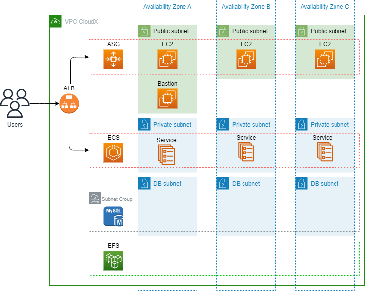

## Second target group (Estimated time: 10h)

## Agenda
In this lab we will use additional platform for launching Ghost application. We will be able to compare different architectures, pros and cons.
To achieve this we will need to create and update some resources:

- Subnets and ECS subnets groups
- Security group
- ECR
- IAM
- Update ALB
- ECS, task definition and service

For this lab you will need basic infrastructure from Basic Infrastructure and External DataBase. You can easly create it with code from Infrastructure as code.

